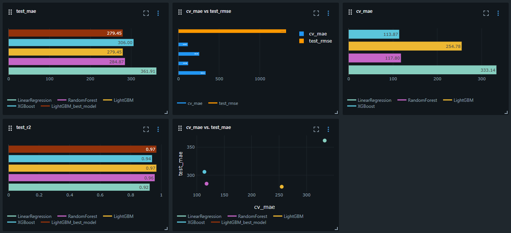
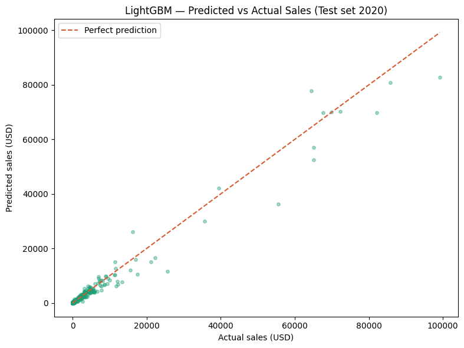
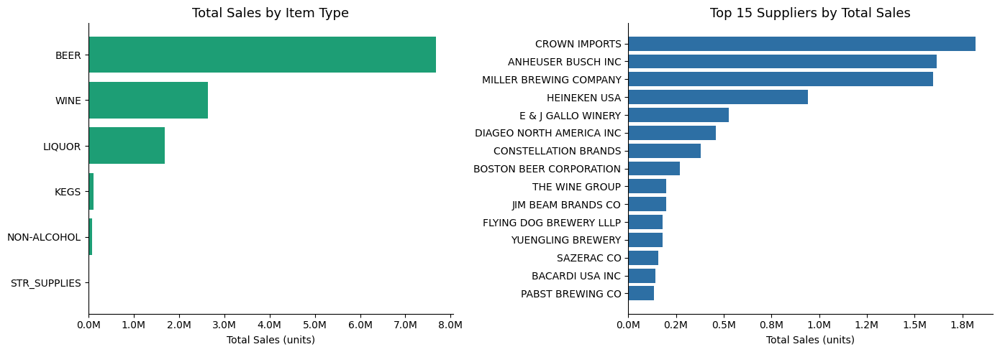
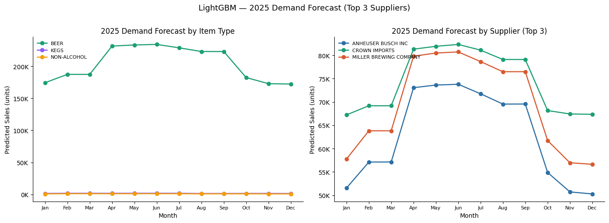

# Warehouse & Retail Sales — End-to-End ML Pipeline


## Overview

End-to-end machine learning pipeline built on **Databricks** using the
**Medallion Architecture** (Bronze → Silver → Gold) on a real government
dataset of warehouse and retail sales transactions from Montgomery County, Maryland.

**Dataset:** 307,645 records · 11 columns · Updated monthly  
**Source:** [Montgomery County of Maryland — Warehouse and Retail Sales](https://catalog.data.gov/dataset/warehouse-and-retail-sales)  
**Publisher:** data.montgomerycountymd.gov  
**Issued:** July 6, 2017 · **Last modified:** May 5, 2026  
**Period covered:** June 2017 — September 2020  
**Categories:** WINE · BEER · LIQUOR · KEGS · NON-ALCOHOL · STR_SUPPLIES

---

## Architecture

```
Raw CSV (307,645 rows)
        │
        ▼
┌───────────────────┐
│      BRONZE       │  Raw ingestion — Delta Table, zero transformations
│    ✅ Complete    │  307,645 rows · 9 columns
└────────┬──────────┘
         │
         ▼
┌───────────────────┐
│      SILVER       │  Cleaned, typed, enriched — 0 nulls
│    ✅ Complete    │  307,645 rows · 11 columns
└────────┬──────────┘
         │
         ▼
┌───────────────────┐
│    EDA (Silver)   │  Exploratory Data Analysis · Distributions · Trends
│    ✅ Complete    │  5 analyses · Key findings documented
└────────┬──────────┘
         │
         ▼
┌───────────────────┐
│       GOLD        │  Business metrics · KPIs · ML-ready feature table
│    ✅ Complete    │  2 tables · 9,980 + 8,219 rows
└────────┬──────────┘
         │
         ▼
┌───────────────────┐
│    ML PIPELINE    │  Demand forecasting · 4 models · TimeSeriesSplit CV
│    ✅ Complete    │  Best model: LightGBM · R² 96.81% · MAE $279.45
└────────┬──────────┘
         │
         ▼
┌───────────────────┐
│    DASHBOARD      │  Business visualizations + 2025 demand forecast
│    ✅ Complete    │  4 sections · Spark SQL optimized · MLflow integration
└───────────────────┘
```

---

## Project Structure

```
warehouse-retail-sales-ml/
│
├── notebooks/
│   ├── 00_setup.ipynb                  ✅ Environment setup & reproducibility guide
│   ├── 01_bronze_ingestion.ipynb       ✅ Raw data ingestion
│   ├── 02_silver_transformation.ipynb  ✅ Cleaning & enrichment
│   ├── 03_silver_EDA.ipynb             ✅ Exploratory analysis
│   ├── 04_gold_layer.ipynb             ✅ Business metrics & ML features
│   ├── 05_ml_model.ipynb               ✅ ML modeling
│   └── 06_dashboard.ipynb              ✅ Visualizations
│
├── assets/                             📊 Charts and visualizations
├── requirements.txt                    📦 Python dependencies with pinned versions
├── .gitignore
├── LICENSE
└── README.md
```

---

## Tech Stack

| Tool | Purpose |
|------|---------|
| Apache Spark 4.1 | Distributed data processing |
| Delta Lake | Reliable storage layer (ACID transactions + time travel) |
| Databricks Free Edition | Compute — no cluster management required |
| MLflow | Experiment tracking and model registry |
| Python 3.12 | Core language |
| scikit-learn | ML models and TimeSeriesSplit cross-validation |
| LightGBM | Gradient boosting — best model |
| XGBoost | Optimized gradient boosting |

---

## Dataset Schema — Silver Layer

| Column | Type | Description |
|--------|------|-------------|
| date | date | Transaction date |
| year | long | Year — kept for groupBy convenience |
| month | long | Month — kept for groupBy convenience |
| supplier | string | Distributor name (uppercase) |
| item_code | string | Product identifier |
| item_description | string | Full product name (uppercase) |
| item_type | string | Category: WINE, BEER, LIQUOR, KEGS, NON-ALCOHOL, STR_SUPPLIES |
| retail_sales | double | Units sold at retail |
| retail_transfers | double | Units transferred between stores |
| warehouse_sales | double | Units sold from warehouse |
| total_sales | double | retail_sales + retail_transfers + warehouse_sales |

---

## Delta Tables

| Table | Layer | Rows | Columns | Status |
|-------|-------|------|---------|--------|
| `main.default.bronze_warehouse_sales` | Bronze | 307,645 | 9 | ✅ Ready |
| `main.default.silver_warehouse_sales` | Silver | 307,645 | 11 | ✅ Ready |
| `main.default.gold_business_metrics` | Gold | 9,980 | 12 | ✅ Ready |
| `main.default.gold_ml_features` | Gold | 8,219 | 14 | ✅ Ready |
| `main.default.gold_model_performance_by_type` | Gold | 6 | 5 | ✅ Ready |
| `main.default.gold_model_performance_by_tier` | Gold | 3 | 5 | ✅ Ready |

---

## ML Pipeline

### Objective

Predict `next_month_sales` for each `item_type + supplier` combination using lag features, rolling averages, and seasonality encoding.

### Feature Engineering

Categorical columns are encoded based on whether they have a natural order:

- `item_type` — no order between categories. Encoded with **One-Hot Encoding** (`pd.get_dummies`, `drop_first=True`). Result: 5 binary columns with prefix `type_`.
- `supplier_tier` — has a real business order: top3 > top15 > rest. Encoded with a **manual ordinal mapping**: top3=2, top15=1, rest=0.

### Train / Test Split

| Set | Years | Rows |
|-----|-------|------|
| Train + CV | 2017, 2018, 2019 | 7,101 |
| Test | 2020 | 1,118 |

Cross-validation uses `TimeSeriesSplit` with 5 folds — validation always uses future data relative to training. The 2020 test set coincides with the COVID-19 pandemic, producing honest metrics under real-world anomaly conditions.

### Model Results

| Model | CV MAE | CV MAE ± | Test MAE | Test RMSE | Test R² |
|-------|--------|----------|----------|-----------|---------|
| **LightGBM** | $254.78 | ±$254.50 | **$279.45** | **$1,320.42** | **96.81%** |
| Random Forest | $117.80 | ±$57.04 | $284.87 | $1,531.15 | 95.71% |
| XGBoost | $113.87 | ±$57.63 | $306.00 | $1,815.49 | 93.96% |
| Linear Regression | $333.14 | ±$247.23 | $361.91 | $2,037.20 | 92.40% |

**Best model: LightGBM** — wins on Test MAE ($279.45), Test RMSE ($1,320.42), and R² (96.81%).

**Why not XGBoost despite its lower CV MAE?**

XGBoost produced the best cross-validation score ($113.87 CV MAE) but degraded by $192 when evaluated on unseen 2020 data ($306.00 Test MAE). This gap reveals that XGBoost's CV score was misleadingly optimistic — the model captured patterns specific to the 2017–2019 training folds that did not hold in 2020.

LightGBM's CV MAE of $254.78 looked worse during validation, but it degraded by only $24 on the test set ($279.45 Test MAE). This small gap is the signal that matters: **LightGBM's CV was honest about what the model would do in production**.

The key diagnostic is not CV MAE alone, but the spread between CV MAE and Test MAE:

| Model | CV MAE | Test MAE | Degradation | Verdict |
|-------|--------|----------|-------------|---------|
| LightGBM | $254.78 ± $254.50 | **$279.45** | **+$24** | ✅ Most honest |
| Random Forest | $117.80 ± $57.04 | $284.87 | +$167 | Moderate gap |
| XGBoost | $113.87 ± $57.63 | $306.00 | +$192 | Largest gap |
| Linear Regression | $333.14 ± $247.23 | $361.91 | +$29 | Honest but weak |

Note: LightGBM's high CV variance (± $254.50) reflects the heterogeneity of the time series folds — some folds are inherently harder than others — not model instability.



### Predictions vs Actual (Test set 2020)




### Performance by Segment

**By product type:**

| Segment | Test MAE | Test R² | Notes |
|---------|----------|---------|-------|
| STR_SUPPLIES | $52.93 | 68.22% | Low volume, stable |
| KEGS | $51.16 | -2.57% | Model worse than average — event-driven demand |
| NON-ALCOHOL | $132.31 | 50.27% | Insufficient features for this segment |
| WINE | $148.51 | 89.87% | Reliable |
| LIQUOR | $176.12 | 95.25% | Reliable |
| BEER | $909.29 | 96.87% | High MAE driven by COVID shock in March 2020 |

**By supplier tier:**

| Tier | Test MAE | Test R² | Notes |
|------|----------|---------|-------|
| rest | $111.75 | 89.38% | Low and stable volumes |
| top15 | $1,523.80 | 87.00% | Hardest segment to forecast |
| top3 | $3,158.06 | 97.32% | Large MAE in dollars but strong pattern capture |

### Model Registry

The trained LightGBM model is registered in the MLflow Model Registry under `workspace.default.lightgbm_sales_forecaster`. Encoding artifacts (`dummy_cols` and `tier_order`) are saved as MLflow artifacts alongside the model for reproducible inference. Segment performance results are persisted as Delta Tables for downstream consumption by the dashboard.

---

## Dashboard

Business visualizations built in `06_dashboard.ipynb` answering four business questions.

### Sales Overview



BEER dominates with 7.67M units — 62.8% of total market. Crown Imports, Anheuser Busch, and Miller Brewing control the majority of warehouse sales. From position 4 onwards volume drops sharply.

### 2025 Demand Forecast



The model projects a summer peak for all top suppliers in April–June 2025, consistent with historical seasonality. Crown Imports leads volume throughout the year peaking at ~82K units in June.

### Dashboard optimization
Aggregations run in Spark before transferring to pandas — 98.4% reduction in data transfer (165 rows transferred vs. ~10K full load). Model and encoders loaded dynamically from MLflow registry with no hardcoded version numbers.

---

## Key Findings

### EDA
- **BEER dominates by volume** — 7.67M units · 62.8% of total market · avg 180.8 units per transaction
- **WINE dominates by frequency** — 187,640 transactions · avg 14.06 units each
- **Top 3 suppliers control 41.2% of total market volume** — Crown Imports (14.9%), Anheuser Busch, Miller Brewing
- **395 distinct suppliers** — extreme concentration in top 3
- **Corona Extra** is the single best-selling product — 352,574 units · present all 24 months
- **All top 20 products are BEER** — no other category appears in the top 20
- **BEER is 85% warehouse channel** (B2B bulk) · **LIQUOR is 94% store-facing** (retail + transfers)

### ML Pipeline
- **LightGBM generalizes best** — wins on all test metrics despite weaker cross-validation scores
- **Lag features drive ~67% of predictions** — recent sales history is the strongest signal by far
- **KEGS is the hardest segment** — negative R² indicates the current feature set is insufficient
- **March 2020 is the largest error month** — COVID-19 demand shock caused a -12.95% underestimation that no model trained on pre-pandemic data could anticipate
- **top15 suppliers are the hardest tier to forecast** — moderate volume combined with high variability produces the weakest R² across tiers

### Dashboard
- **Summer seasonality is market-wide** — all top 3 suppliers peak in April–June every year
- **2025 forecast projects same seasonal pattern** — Q1 stockpiling recommended for BEER
- **98.4% data transfer reduction** via Spark SQL aggregations before pandas load

---

## Author

**Santiago López Blanco**  
Data Science Engineering Student — Universidad Fidélitas, Costa Rica

[](https://www.linkedin.com/in/santiago-l%C3%B3pez-blanco-ds)

---

> Last updated: May 2026
